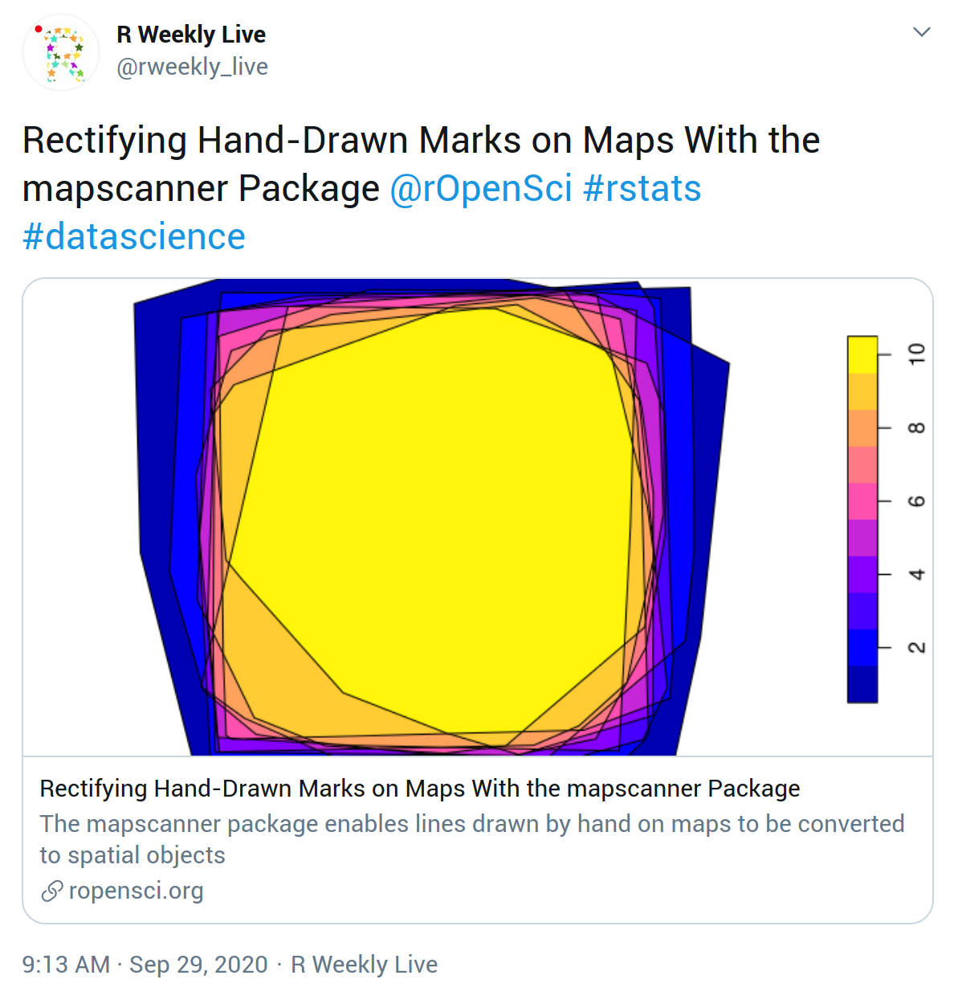

# (APPENDIX) Appendix {-}

# Template - Post (md) {#templatemd}

Use of this template is described in [Start the post from a template](#templates) and [Walkthrough with code snippets](#usetemplates).

Markdown template to be saved as `/content/blog/YYYY-MM-DD-slug/index.md`

Notice the copy-paste button at the top-right corner of the template.

```{r posttemplatemd, results="asis"}
show_template("https://github.com/ropensci/roweb3/raw/master/archetypes/md/index.md", lang = "markdown")
```

# Template - Post (Rmd) {#templatermd}

Use of this template is described in [Start the post from a template](#templates) and [Walkthrough with code snippets](#usetemplates).

R Markdown template to be saved as `/content/blog/YYYY-MM-DD-slug/index.Rmd`

[Available on GitHub](https://github.com/ropensci/roweb3/blob/master/archetypes/Rmd/index.md) (_not displayed for copy-paste because of "html_preserve" tags_)

# Template - Author file {#authortemplate}

Use of this template is described in [Create or update your author file](#createauthorfile).

Author file template to be saved as `/content/authors/yourfirstname-yourlastname/_index.md` as described in [Technical Guidelines](#createauthorfile).

Notice the copy-paste button at the top-right corner of the template.

```{r authorfiletemplate, results="asis"}
show_template("author-file-template.md", lang = "yaml")
```

# Author Checklist - Posts on peer-reviewed packages {#authorchecklistpeer}

Use of this template is described in [Pre-submission checks](#presubchecks).

Copy this checklist into the first comment on your pull request.
Notice the copy-paste button at the top-right corner of the template.

```{r checklistpkg2, echo = FALSE}
show_checklist(c("submission-checklist.csv", "submission-checklist-peer-reviewed-pkg.csv"))
```

# Author Checklist - Other posts {#authorchecklistany}

Use of this template is described in [Pre-submission checks](#presubchecks).

Copy this checklist into the first comment on your pull request. 
Notice the copy-paste button at the top-right corner of the template.

```{r checklistother2, echo = FALSE}
show_checklist("submission-checklist.csv")
```

# Editor Checklist - Posts on peer-reviewed packages {#editorchecklistpeer}

Use of this template is described in [Review a Post](#review).

Copy this checklist to your GitHub review summary.
Notice the copy-paste button at the top-right corner of the template.

```{r checklisteditor2, echo = FALSE}
show_checklist(c("editor-checklist.csv", "editor-checklist-peer-reviewed-pkg.csv"))
```

# Editor checklist - Other posts {#editorchecklistany}

Use of this template is described in [Review a Post](#review).

Copy this checklist to your GitHub review summary.
Notice the copy-paste button at the top-right corner of the template.

```{r checklisteditorprp2, echo = FALSE}
show_checklist("editor-checklist.csv")
```

# Twitter cards {#twittercards}

A [Twitter card](https://developer.twitter.com/en/docs/tweets/optimize-with-cards/overview/abouts-cards) means than when a URL is included in a tweet, what other Twitter users see is not the URL but instead a "card", i.e. the metadata from the URL rendered in a nice preview.
The Twitter metadata in a [post's YAML](whatgoesinyaml) helps it "look good" when an account like R Weekly Live or other readers link to the post in a tweet. 
The relevant YAML tags for rOpenSci posts are `title`, `description`, `twitterImg`, `twitterAlt`.
These same metadata tags might be picked up by other platforms such as Slack.

If a specific `description` is not specified, the first sentences of the post (~100 characters) are used.
If a specific `twitterImg` is not specified, a thumbnail of the rOpenSci logo is used. 
If you use `twitterImg` also use `twitterAlt` to provide alternative text for screenreader users.

This is what a tweet about an rOpenSci post looks like by default.

```{r twitter_default, echo = FALSE, fig.alt = "Example of tweet without twitterImg specified"}
knitr::include_graphics("images/twitterImg_default.png")
```

This is what a tweet about an rOpenSci post looks like with YAML `twitterImg` specified.

```{r twitterImg, echo = FALSE, fig.alt = "Example of tweet with twitterImg specified"}

```

If you specify a `twitterImg`, ensure that its dimensions are appropriate. 
(Search for those in a search engine for current recommendation.) 
These may be different from the dimensions of an image featured in your post. 
You could save a separate copy of an image for the purpose of `twitterImg` only if you think it will draw people to read your post.

How do you know what it will look like?
You can check the Twitter metadata by pasting a post's preview link in the [Twitter card validator](https://cards-dev.twitter.com/validator). 
You might have to click the validator twice.

