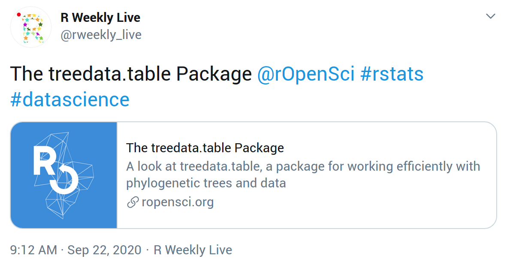
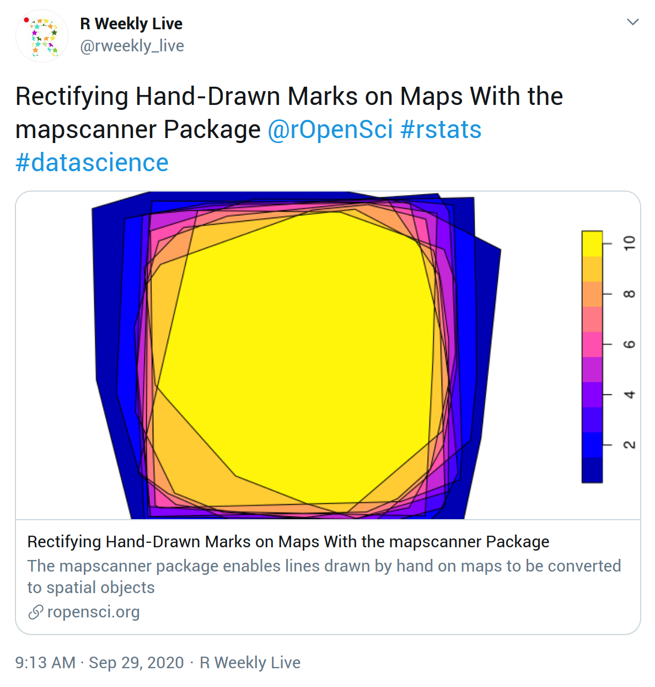

# (APPENDIX) Appendix {-}

# Template - Post (md) {#templatemd}

Use of this template is described in [Start the post from a template](#templates) and [Walkthrough with code snippets](#usetemplates).

Markdown template to be saved as `/content/blog/YYYY-MM-DD-slug/index.md`

You can hover over the top-right corner of the template to make a copy-paste button appear.

````markdown
---
slug: "post-template"
title: Post Title in Title Case
# Delete the package_version line below if your post is not about a package
package_version: 0.1.0
author:
  - Author Name1
  - Author Name2
# Set the date below to the publication date of your post
date: 2020-03-10
# Minimal tags for a post about a community-contributed package 
# that has passed software peer review are listed below
# Consult the Technical Guidelines for information on choosing tags
tags:
  - Software Peer Review
  - packages
  - R
  - community
# The summary below will be used by e.g. Twitter cards
description: "A very short summary of your post (~ 100 characters)"
# If you have no preferred image for Twitter cards,
# delete the twitterImg and twitterAlt lines below 
# - Replace "blog" with "technotes" as needed
# - Note "/" between year/month/day
twitterImg: blog/2019/06/04/post-template/name-of-image.png
twitterAlt: "Alternative description of the image"
# the text below is for populating the "share on Twitter" button
# if deleted, the title of the post will be used
tweet: "A post about blabla by @username!"
---

This is the Markdown (.md) template for a blog post or tech note. 
To generate your post with R Markdown (.Rmd), use that template instead.

Throughout this template, including the YAML, 
you should change "post-template" to the slug of your post, 
and "2019-06-04" to your publication date.

Save this file under /content/blog/YYYY-MM-DD-slug/index.md in the local copy of your roweb3 fork.

## Section heading in sentence case

Citation of the primary literature[^1]. 

Citation of a website[^2]. 

Citation of an R package[^3].

### Subsection heading

We recommend the use of [Hugo shortcodes](https://gohugo.io/content-management/shortcodes/) to include images, tweets, videos, gists, etc.

**Add an image** by using a Hugo shortcode. The image is saved under `/content/blog/YYYY-MM-DD-slug/name-of-image.png`.



Consult the Technical Guidelines for tips on changing image size, alignment, and for advice on alternative text.

**Embed a tweet** by using a Hugo shortcode. 




**Add citation or footnote** text by using the format below 

[^1]: Sciaini, M., Fritsch, M., Scherer, C., & Simpkins, C. E. (2018). NLMR and landscapetools: An integrated environment for simulating and modifying neutral landscape models in R. Methods in Ecology and Evolution, 9(11), 2240-2248. <https://doi.org/10.1111/2041-210X.13076>
[^2]: Elin Waring, Michael Quinn, Amelia McNamara, Eduardo Arino de la Rubia, Hao Zhu and Shannon Ellis (2019). skimr: Compact and Flexible Summaries of Data. R package version 1.0.7. https://CRAN.R-project.org/package=skimr
[^3]: Hugo static site generator. https://gohugo.io/
````

# Template - Post (Rmd) {#templatermd}

Use of this template is described in [Start the post from a template](#templates) and [Walkthrough with code snippets](#usetemplates).

R Markdown template to be saved as `/content/blog/YYYY-MM-DD-slug/index.Rmd`

[Available on GitHub](https://github.com/ropensci/roweb3/blob/master/archetypes/Rmd/index.md) (_not displayed for copy-paste because of "html_preserve" tags_)

# Template - Author file {#authortemplate}

Use of this template is described in [Create or update your author file](#createauthorfile).

Author file template to be saved as `/content/authors/yourfirstname-yourlastname/_index.md` as described in [Technical Guidelines](#createauthorfile).

You can hover over the top-right corner of the template to make a copy-paste button appear.

````yaml
---
name: Author Name
link: website URL or other online presence
twitter: Twitter username
github: GitHub username
gitlab: GitLab username
keybase: Keybase ID
orcid: ORCID ID
---
````

# Author Checklist - Posts on peer-reviewed packages {#authorchecklistpeer}

Use of this template is described in [Pre-submission checks](#presubchecks).

Copy this checklist into the first comment on your pull request.
You can hover over the top-right corner of the template to make a copy-paste button appear.

````markdown
* [ ] I have read the Content Guidelines.
* [ ] I have read the Technical Guidelines.
* [ ] I used or followed the R Markdown or Markdown template.
* [ ] I have followed the Style Guide.
* [ ] I created or updated my author metadata with correct folder name.
* [ ] I have added relevant tags after browsing existing tags (incuding "community" tag).
* [ ] I have added the "tech notes" tag if this is a technote.
* [ ] I ran `roblog::ro_lint_md()` on index.md (optional).
* [ ] I ran `roblog::ro_check_urls()` on index.md (optional).
* [ ] I ran a spell-check on index.md.
* [ ] I have added the tags - Software Peer Review, my-packagename.
* [ ] I have added the package-version YAML tag.
* [ ] I have added acknowledgement of the reviewers' work (with links to reviewers).
* [ ] I have added a link to the software peer review thread.
* [ ] I ran a spell-check on index.md.
````

# Author Checklist - Other posts {#authorchecklistany}

Use of this template is described in [Pre-submission checks](#presubchecks).

Copy this checklist into the first comment on your pull request. 
You can hover over the top-right corner of the template to make a copy-paste button appear.

````markdown
* [ ] I have read the Content Guidelines.
* [ ] I have read the Technical Guidelines.
* [ ] I used or followed the R Markdown or Markdown template.
* [ ] I have followed the Style Guide.
* [ ] I created or updated my author metadata with correct folder name.
* [ ] I have added relevant tags after browsing existing tags (incuding "community" tag).
* [ ] I have added the "tech notes" tag if this is a technote.
* [ ] I ran `roblog::ro_lint_md()` on index.md (optional).
* [ ] I ran `roblog::ro_check_urls()` on index.md (optional).
* [ ] I ran a spell-check on index.md.
````

# Editor Checklist - Posts on peer-reviewed packages {#editorchecklistpeer}

Use of this template is described in [Review a Post](#review).

Copy this checklist to your GitHub review summary.
You can hover over the top-right corner of the template to make a copy-paste button appear.

````markdown
* [ ] post follows Content Guidelines
* [ ] post follows Style Guide
* [ ] title is in Title Case
* [ ] publication date is ok
* [ ] alternative text of images is informative
* [ ] Twitter metadata looks ok (paste post preview link in [Twitter card validator](https://cards-dev.twitter.com/validator); might have to click twice on "Preview card")
* [ ] author metadata is provided with correct folder name
* [ ] html not included in pull request of Rmd post
* [ ] I ran `roblog::ro_lint_md()` on index.md
* [ ] I ran `roblog::ro_check_urls()` on index.md
* [ ] I ran a spell-check on index.md
* [ ] YAML subject tags are ok ("tech notes" for tech notes; "community" for non-staff non-editor)
* [ ] YAML package-version included
* [ ] YAML subject tags - software peer review, packagename
* [ ] acknowledges and links to reviewers
* [ ] links to peer review thread
````

# Editor checklist - Other posts {#editorchecklistany}

Use of this template is described in [Review a Post](#review).

Copy this checklist to your GitHub review summary.
You can hover over the top-right corner of the template to make a copy-paste button appear.

````markdown
* [ ] post follows Content Guidelines
* [ ] post follows Style Guide
* [ ] title is in Title Case
* [ ] publication date is ok
* [ ] alternative text of images is informative
* [ ] Twitter metadata looks ok (paste post preview link in [Twitter card validator](https://cards-dev.twitter.com/validator); might have to click twice on "Preview card")
* [ ] author metadata is provided with correct folder name
* [ ] html not included in pull request of Rmd post
* [ ] I ran `roblog::ro_lint_md()` on index.md
* [ ] I ran `roblog::ro_check_urls()` on index.md
* [ ] I ran a spell-check on index.md
* [ ] YAML subject tags are ok ("tech notes" for tech notes; "community" for non-staff non-editor)
````

# Twitter cards {#twittercards}

A [Twitter card](https://developer.twitter.com/en/docs/tweets/optimize-with-cards/overview/abouts-cards) means than when a URL is included in a tweet, what other Twitter users see is not the URL but instead a "card", i.e. the metadata from the URL rendered in a nice preview.
The Twitter metadata in a [post's YAML](whatgoesinyaml) helps it "look good" when an account like R Weekly Live or other readers link to the post in a tweet. 
The relevant YAML tags for rOpenSci posts are `title`, `description`, `twitterImg`, `twitterAlt`.
These same metadata tags might be picked up by other platforms such as Slack.

If a specific `description` is not specified, the first sentences of the post (~100 characters) are used.
If a specific `twitterImg` is not specified, a thumbnail of the rOpenSci logo is used. 
If you use `twitterImg` also use `twitterAlt` to provide alternative text for screenreader users.

This is what a tweet about an rOpenSci post looks like by default.



This is what a tweet about an rOpenSci post looks like with YAML `twitterImg` specified.



If you specify a `twitterImg`, ensure that its dimensions are appropriate. 
(Search for those in a search engine for current recommendation.) 
These may be different from the dimensions of an image featured in your post. 
You could save a separate copy of an image for the purpose of `twitterImg` only if you think it will draw people to read your post.

How do you know what it will look like?
You can check the Twitter metadata by pasting a post's preview link in the [Twitter card validator](https://cards-dev.twitter.com/validator). 
You might have to click the validator twice.

