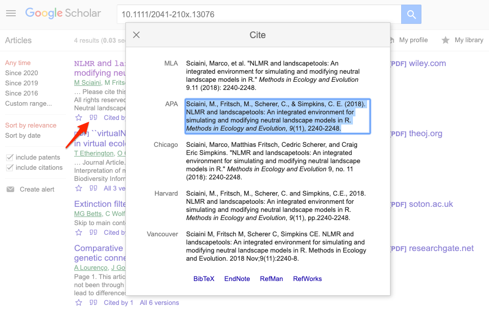
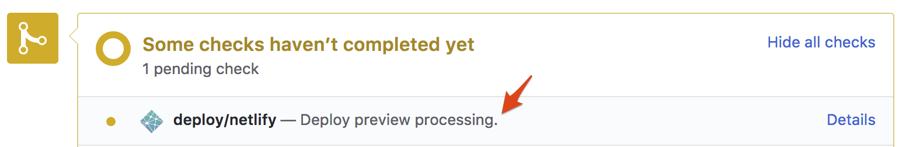
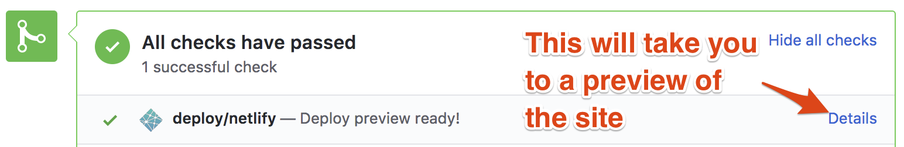

# Technical Guidelines {#technical}

```{block, type='summaryblock', echo=TRUE}
This chapter explains the technical details of submitting a blog post or tech note (referred to collectively as "posts") for publication on the rOpenSci website - from drafting in an (R) Markdown template, to submitting for review using GitHub Pull Request infrastructure.

We include advice on commonly used elements like adding [an image](#addimage), [a citation](#addcitation), or [embedding a social media post](#addsocialpost) in case you need them.
```


Briefly, the process is:

1. Get the go-ahead and a tentative publication date from our Community Manager.
1. Fork the repository (repo) of the rOpenSci website.
1. Draft your post in R Markdown or Markdown and create or update your author metadata.
1. Preview and refine your post locally.
1. Submit via pull request and preview your post.
1. A blog editor reviews your post.
1. Revise your post in response to review.

This chapter links to templates for posts and checklists that you can also find in the Appendix.

## Fork the `roweb3` repository {#forkcreate}

Fork the rOpenSci website [repository](https://github.com/ropensci/roweb3) and create a new branch to work on your post. 
For help with this aspect of git/GitHub, we recommend [happygitwithr](https://happygitwithr.com/fork-and-clone.html) and the [pull request helpers of the usethis package](https://usethis.r-lib.org/articles/articles/pr-functions.html).

## Install blogdown

If you plan to use R Markdown to write your post (using `index.Rmd` as opposed to directly writing it in Markdown with `index.md` and not executing any code), please install or update blogdown.

```r
install.packages("blogdown")
```

## Author files {#createauthorfile}

Create or update your author file.

### Why?

The rOpenSci website has a page listing [all authors](https://ropensci.org/author/) who have contributed to a blog post, tech note, presented in a Community Call, host a co-working session, deliverd a talk about rOpenSci's activities or contribute to some of our projects like the [Champions Program](https://ropensci.org/champions/).
A click on your by-line in a post takes the reader to your author page that has links to your online home, possibly your social media or GitHub profile(s), and a list of all the content you’ve authored on our site.
For staff and leadership team members, editors for software peer review, members of our Code of Conduct Committee, and participants of our Champions Program, their rOpenSci title is also listed on their author page.


### How?
If you don't already have an author page, create a folder called `yourfirstname-yourlastname` in your local copy of [`roweb3/content/author/`](https://github.com/ropensci/roweb3/tree/HEAD/content/author).
You can have accents, middle initials, or hyphens appear in your name if you name your folder appropriately. That can be tricky so we have examples below.

In that folder, create a file called `_index.md` with information about your online presence.
You can copy this template below (or get it via [roblog](https://docs.ropensci.org/roblog/reference/blog-posts.html) after installing it via `install.packages("roblog", repos = "https://dev.ropensci.org")` ).

```{r authorfiletemplate1, results="asis"}
blogguidance::show_template("author-file-template.md", 
              lang = "yaml",
              details = TRUE
)
```

At minimum, provide your name and a link or your Social Media, GitHub, or GitLab username.
Add your usernames or ID's without the "@" or the "https:...". The link field can be your personal website URL, for example.

### Example

This author file, [`/author/maëlle-salmon/_index.md`](https://github.com/ropensci/roweb3/blob/HEAD/content/author/ma%C3%ABlle-salmon/_index.md)

```yaml
---
name: Maëlle Salmon
mastodon: https://mastodon.social/@maelle
bio: rOpenSci Research Software Engineer, Associate editor of rOpenSci Software Peer Review
github: maelle
gitlab: maelle
keybase: maelle_salmon
orcid: 0000-0002-2815-0399
---
```

... generates [Maëlle Salmon's author page](https://ropensci.org/author/ma%C3%ABlle-salmon/).

For an example of how to name the folder with an accent and initials, see this [author file](https://github.com/ropensci/roweb3/blob/HEAD/content/author/rich%C3%A8l-j.c.-bilderbeek/_index.md) that generates [Richèl J.C. Bilderbeek's author page](https://ropensci.org/author/rich%C3%A8l-j.c.-bilderbeek/).
The folder name must include accents, initials with periods, and hyphens for spaces, in order to link to their blog content.

Look at [other people's folder names](https://github.com/ropensci/roweb3/tree/HEAD/content/author) for examples. 

Your author page will show the picture you have on your GitHub profile.

## Post template {#templates}

Start your post from a template. If you use RStudio, refer to [the instructions to create your draft with blogdown's New Post Addin](#blogdownaddin).
If not, refer to [the instructions to create your draft manually](#manually).

### New Post Addin {#blogdownaddin}

The blogdown New Post RStudio addin creates the post draft in the correct location and fills the post YAML based on metadata you'll have entered.[^2]

* Install `whoami` and `blogdown` (`install.packages(c("whoami", "blogdown"))`) (blogdown version should be at least 1.6.0).
* Install Hugo (to preview the post): `blogdown::install_hugo("0.133.0")` (version recorded in netlify.toml of the roweb3 repository).
* Re-start R.
* In RStudio, open the forked `roweb3` project.
* Create a new post by running Addins > New Post or `blogdown:::new_post_addin()`.
* Leave "Categories" blank (and ignore in the file created)

```{r blogdownaddin, echo = FALSE, fig.alt = "blogdown's New Post Addin.", out.width = "70%", fig.align="center"}
knitr::include_graphics("images/blogdownaddin.png", dpi = 25)
```

  * Enter a title, no need to worry about title case at this stage.
  * Enter your name if `whoami` wasn't able to guess it.
  * Choose the correct date.
  * Enter a new slug if the default one is too long.
  * Choose "blog" as a Subdirectory from the drop-down menu.
  * Choose an Archetype, Rmd or md, from the drop-down menu.
  * Also choose the correct Format: .Rmd if Rmd, Markdown (.md) if md. Never choose .RMarkdown.
  * Ignore Categories.
  * Select "tech notes" tag if this is a tech note
  * Select any other relevant tags and/or create new ones
  * Click on "Done", your post draft will have been created and opened.

### Manually {#manually}

Create a folder `YYYY-MM-DD-slug/` (e.g. `2020-01-20-rorcid/`) under `/content/blog/`
Your post source and its images should live in `/content/blog/YYYY-MM-DD-slug/`.[^1]

* [R Markdown template](#templatermd) is to be saved as `/content/blog/YYYY-MM-DD-slug/index.Rmd`. It will need to be knit (RStudio knit button, or `blogdown::build_site(build_rmd = <path_to_file>)`). Add both `index.Rmd` and `index.md`to your PR.

* [Markdown template](#templatemd) is to be saved as `/content/blog/YYYY-MM-DD-slug/index.md`.

## Adding content {#usetemplates}

### YAML {#whatgoesinyaml}

The YAML sets the metadata for a post. This is the YAML from our [post template](#templatermd), with comments to explain some components.

> **Note:** The New Post Addin automatically creates a `categories` component, but you should ignore or remove this and use `tags` instead.

```{r posttemplate, results="asis"}
blogguidance::show_template("https://github.com/ropensci/roweb3/raw/HEAD/archetypes/md/index.md", 
              lang = "yaml",
              yaml_only = TRUE)
```

If you need to add an alert box at the beginning of the post, use the `preface` field with the Markdown syntax.

```yaml
preface: "some alert"
```

#### Subject tags

Add tags to the YAML of your post to make it more findable. Browse [our page that lists all tags in use](https://ropensci.org/tags/) and re-use an existing tag rather than creating a new one e.g. 'packages' exists, so use that, rather than 'package'.

For a post about your peer-reviewed package, use 'Software Peer Review', 'community', 'packages', the package name, and any others you see fit.

#### Social media metadata (optional)

If you're curious about the `description`, `socialImg`, `socialAlt` YAML fields in the post metadata and how they can help draw readers to your post, refer to [our explanation of social media cards](#twittercards).

Delete `description`, `socialImg` and `socialAlt` YAML fields if you don't use them. 

#### Default social media text (optional)
Provide default text for social media post (Mastodon and LinkedIn) when a reader clicks the "Share on Mastodon" button by
replacing the value of `social: "A post about blabla by @username!"`.
Consider including your (and your coauthors) Mastodon handle(s) (`@username`) in the post
text to ensure you get notified when someone shares your post.


### Images - General

Images can either be [external](#addimage) or created in [rmarkdown](#addfigure). 
Regardless of how images are included, they should all contain **alt** text 
and consider the following features.

**Alt text**  
Every image should be accompanied by alternative text to make it more accessible and provide a better user experience.
The alternative text should convey the meaning or content that is displayed in the image.
Refer [to this tutorial for details on what should go in alternative text](https://www.w3.org/WAI/tutorials/images/informative/), 
and see the following sections for how to include alt text.

If your include a picture because of some text (like a comment in a post or a phrase in a wall), you have to write the text you want to highlight from that image in the alt-tex. 


**Image features**  

- Consider transparent backgrounds as the blog background is not white 
  (hex logos etc. will look better this way)
- Keep images < 1 mb
  - Large images can be compressed/optimized with tools like
  - [OptiPNG](http://optipng.sourceforge.net/) (Local software, 
  [also integrates with rmarkdown](https://bookdown.org/yihui/rmarkdown-cookbook/optipng.html))
  - [minimage](https://github.com/ardata-fr/minimage) (Local software)
  - [TinyPNG](https://tinypng.com/) (Online tool)


### Images - External {#addimage}

> This section refers to images that are **not** generated from R Markdown. 
> If you want to **generate** images from R Markdown use [our R Markdown template](https://github.com/ropensci/roweb3/blob/HEAD/archetypes/Rmd/index.md) and see [next subsection](#addfigure).

**File location**  
All images go in the same folder as your post source (`/content/blog/YYYY-MM-DD-slug/`) 
(do not link to external services like imgur).
To reference them in your post, use `name-of-image.png`. 

**Insert an image**

- **Insert** an image with either `figure` or `imgtxt` short codes
  - Note the use of `alt =` to specify [alt text](#images)
  - `{}`
  - imgtxt:

```
{} 
Text to right 
{}
```
  
**Image placement**

- Basic positioning with `{}` and `class`

  `{}`
    - `pull-left` - Left-align the picture and wrap text around it
    - `center` - Center the picture (no text wrapping)
    - `pull-right` - Right-align the picture and wrap text around it
  
```{r, out.width = "30%", fig.align = "center"}

```
  
- Specific text next to image with ``

  `{} Text to right {} Text below`
    - Only text between `{}` and `{}` is to the right of the figure

```{r, out.width = "30%", fig.align = "center"}

```

- For images side-by-side, create a composite and insert as a single image
    - Consider [gimp](https://www.gimp.org) for free and open source image manipulation software
    - Consider the R package [patchwork](https://patchwork.data-imaginist.com/) for combining R figures

**Other details**

- Control image **size** with `width`  
  `{}`

- Make the image a **hyperlink** with `link`  
  `{}`

**Important!**  In **R Markdown** (i.e. in \*.Rmd files but NOT \*.md files), these Hugo shortcodes need to be escaped:  

<code>&lt;!\-\-html_preserve\-\-></code>    
<code></code>  
<code>&lt;!\-\-/html_preserve\-\-></code>  


### Images - Rmd-created {#addfigure}

**File location**   
When using [our R Markdown template](https://github.com/ropensci/roweb3/blob/HEAD/archetypes/Rmd/index.md) the knitr hook in the setup chunk actually creates the necessary Hugo shortcodes. 
Therefore you don't need to worry about paths.

**Image details**    
In the chunk producing a figure, use the `hugoopts` chunk option to control the **alt text** and other elements.
`hugoopts` is a named list that can have all elements described in the [documentation of the Hugo figure shortcode](https://gohugo.io/content-management/shortcodes/#figure) except for `title`.

````markdown
```{r chunkname, hugoopts=list(alt="alternative text please make it informative", caption="this is what this image shows, write it here or in the paragraph after the image as you prefer", width=300)} `r ''`
plot(1:10)
```
````

This chunk above produces a figure with _"alternative text please make it informative"_ as alternative text, _"title of the image"_ as title, _"this is what this image shows, write it here or in the paragraph after the image as you prefer"_ as caption, and a width of 300 pixels.

### Citations and footnotes {#addcitation}

To add citations, refer to them in the body of your post as footnotes:
```
Citation of the primary literature[^1].
Citation of an R package[^2].
Citation of a website[^3].
```

And list your sources at the bottom of your post:

```
[^1]: Sciaini, M., Fritsch, M., Scherer, C., & Simpkins, C. E. (2018). NLMR and landscapetools: An integrated environment for simulating and modifying neutral landscape models in R. Methods in Ecology and Evolution, 9(11), 2240-2248. <https://doi.org/10.1111/2041-210X.13076>
[^2]: Elin Waring, Michael Quinn, Amelia McNamara, Eduardo Arino de la Rubia, Hao Zhu and Shannon Ellis (2019). skimr: Compact and Flexible Summaries of Data. R package version 2.0.2. https://CRAN.R-project.org/package=skimr
[^3]: Hugo static site generator. https://gohugo.io/
```

#### Finding citations

To get the citation for an R package, run `citation("packagename")`.

To get the citation for an article, you can use the RStudio Addin for [rcrossref](https://docs.ropensci.org/rcrossref/), or get the citation from a paper's DOI by running e.g.

```
rcrossref::cr_cn("10.1111/2041-210X.13076", format="text", style="apa")

[1] "Sciaini, M., Fritsch, M., Scherer, C., & Simpkins, C. E. (2018). NLMRandlandscapetools: An integrated environment for simulating and modifying neutral landscape models inR. Methods in Ecology and Evolution, 9(11), 2240–2248. doi:10.1111/2041-210x.13076"
```

To get the citation for an article in [Google Scholar](https://scholar.google.com/), find the article, click the quote symbol (in search results under the article) to open the "Cite" window, and copy the APA style text.


```{r citation, echo = FALSE, fig.alt = "Get a citation from Google Scholar."}

```

### Embedded tweets {#addtweet}

Use a [Hugo shortcode](https://gohugo.io/content-management/shortcodes/#tweet) to embed a tweet using its username and its ID e.g. `{}`. In R Markdown, shortcodes need to be html escaped, refer to [the template](https://github.com/ropensci/roweb3/blob/HEAD/archetypes/Rmd/index.md) for an example.
  
If you want to quote a tweet and make it look more subdued, you can use a [block quote](#blockquotes) linking the tweet.
 [Example](https://ropensci.org/blog/2021/02/03/targets/), [source](https://github.com/ropensci/roweb3/blob/0528c5a9e0ea781dd78a9f70c1e49d034f39fd69/content/blog/2021-02-03-targets/index.md?plain=1#L35).

### Block quotes {#blockquotes}

#### Block quotes with no attribution

E.g. if you want to highlight a sentence from the post itself.

Block quotes are paragraphs starting with `>`.

If you want to have them right-align add `{.blockquote .text-right}` right after the paragraph e.g.

```markdown
> blabla
blabla
blabla
{.blockquote .text-right}
```
If you want to have them centered add `{.blockquote .text-center}` right after the paragraph e.g.
```markdown
> blabla
blabla
blabla
{.blockquote .text-center}
```
#### Block quotes with attribution

If you want to add a block quote with an author name, use:

```markdown
{}
Blablablabla  
{}
```

If you want to add a block quote with an author name and a source, use:

```markdown
{}
Blablablabla  
{}
```

If you want to center the block quote add the align variable:

```markdown
{}
Blablablabla  
{}
```

If you want to right-align the block quote add the align variable:

```markdown
{}
Blablablabla  
{}
```

Note that this syntax also work for quotes without attribution!

```markdown
{}
Blablablabla  
{}
```

### Tables

If you want to use e.g. [striped tables](https://getbootstrap.com/docs/4.6/content/tables/), add `{.table .table-responsive .table-striped}` right after the last line of the table.

```markdown
Header   | Other Header | Another Header
---------|----------------|-------------------
Value 11 | Value 12       | Value 13
Value 21 | Value 22       | Value 23
Value 31 | Value 32       | Value 33
{.table .table-responsive .table-striped}
```

### Examples

Comparing the raw Markdown to the live posts in these examples might be helpful.

- A blog post about a package that has passed software peer review.
Compare [raw markdown](https://raw.githubusercontent.com/ropensci/roweb3/HEAD/content/blog/2019-10-21-rmangal.md) with the [live post](https://ropensci.org/blog/2019/10/21/rmangal/).

- A tech note.
Compare [raw markdown](https://raw.githubusercontent.com/ropensci/roweb3/HEAD/content/blog/2018-10-06-av-release.md) with the [live tech note](https://ropensci.org/technotes/2018/10/06/av-release/).

## Multilingual posts

**Please discuss your post's language with blog editors!**

- Our website's default language is English so only posts in English are called `index.md`.
- For **translating** a post, create a file in the same folder as the original post but called `index.<two-letter-language-code>.md`, for instance  `index.es.md`. Translate tags, title, description too.
- For a post in a single non-English language omit the `index.md` file and only use the `index.XX.md` file using the appropriate language code (e.g., `index.es.md` for a Spanish-only post).
- Add an author file in `content/author/author-name/_index.<two-letter-language-code>.md` even if it only duplicates `content/author/author-name/_index.md`.
- If you are writing the first blog entry for a particular language (yay!), please ask blog editors to notify the website team so we can add translation for the blog infrastructure (such as "Share this page" and similar phrases).
- Feel free to checkout the [rOpenSci translation guide](https://translationguide.ropensci.org/) for how we are translating rOpenSci material in general.

## Style Guide {#styleguide}

- **Formatting**
  - For package names, functions, and code, follow the [tidyverse style guidance](https://style.tidyverse.org/documentation.html#r-code). 
  - Format package names as regular text (no quotes).
  - Do not use markdown in titles (but you can use them in headings).
  - Use ## and ### to format headings in your post, i.e. section titles as ## (h2) and subsections as ### (h3), #### (h4).
  - Add new line at end of each sentence ([makes diffs easier to interpret and easier for editor to suggest specific changes](https://cirosantilli.com/markdown-style-guide#line-wrapping)).
  - 'rOpenSci' not 'ROpenSci'
- **Links and images**
  - When adding rOpenSci links to your post, use relative instead of absolute URLs e.g. `/blog/` instead of `https://ropensci.org/blog/`.
  - When linking to [rOpenSci packages](https://ropensci.org/packages/) use their docs.ropensci.org URL, e.g. https://docs.ropensci.org/drake/.
  - Use [Hugo shortcodes](https://gohugo.io/content-management/shortcodes/#use-hugos-built-in-shortcodes) (not html) to add images, tweets, gists etc. 
  - In R Markdown wrap Hugo shortcodes between html preserve tags as shown in the [template](https://github.com/ropensci/roweb3/blob/HEAD/archetypes/Rmd/index.md).
  - Instead of using html widgets (`DT`, `leaflet`, etc.), include a screenshot and use the `link` option of the [Hugo `figure` shortcode](https://gohugo.io/content-management/shortcodes/#use-hugos-built-in-shortcodes) to direct readers to an online version of the widget.
  - Use informative [alternative text](#addimage) for all images.
- **Language**
  - **All languages** Avoid Latin phrases such as "e.g." (for instance) or "i.e." (that is to say).
  Use phrases in the language of your post instead.
  - **English** - Use title case for the title of your post; use sentence case for headings inside the post.
  - **Non-English** - If using English words, use italics for the word in 
  English and translate directly in parentheses the first time it is mentioned


## Pre-submission checks {#presubchecks}

### Knit post

If using the R Markdown template, knitting `index.Rmd` (RStudio knit button, or `blogdown::build_site(build_rmd = <path_to_file>)`) will generate `index.md`. Commit both `index.Rmd` and `index.md`. 

### Check with `roblog`

You can use functions in the [roblog package to do some automated checks](https://docs.ropensci.org/roblog/articles/checks-guidance.html) on your post. 

- `ro_lint_md()` to check and enforce use of complete alternative descriptions for image, of relative links to rOpenSci website, of [Hugo shortcodes](https://gohugo.io/content-management/shortcodes/#use-hugos-built-in-shortcodes) for tweets.
- `ro_check_urls()` to check for URLs that might be broken 

### Author Checklist {#checklists}

Pick the appropriate checklist for your post and ensure you checked everything off. 
Notice the copy-paste button at the top-right corner of the list.

#### Posts on peer-reviewed packages

```{r checklistpkg, echo = FALSE}
blogguidance::show_checklist(c("submission-checklist.csv", "submission-checklist-peer-reviewed-pkg.csv"))
```

#### Other posts

```{r checklistother, echo = FALSE}
blogguidance::show_checklist("submission-checklist.csv")
```

### Local preview {#localpreview}

If you wish to preview your post locally, as it will appear in our site, you must install Hugo.
To install, refer to [Hugo docs](https://gohugo.io/getting-started/installing/) or run `blogdown::install_hugo()` using the version recorded in [netlify.toml](https://github.com/ropensci/roweb3/blob/HEAD/netlify.toml). 

**Note:** You can also preview your blog post online through the pull request before the final submission.

Then run `hugo serve` or `blogdown::serve_site()` in the repo directory to start a local server on http://localhost:1313 (or another one indicated by blogdown). 
  
**Note:** If you are used to using hugodown you can use it instead to serve the website.

The version of Hugo used by the rOpenSci web server is defined in [netlify.toml](https://github.com/ropensci/roweb3/blob/HEAD/netlify.toml).

When this preview looks good to you, you should submit your post as a pull request.


## Submit draft post {#submitpost}


### Create draft pull request

* Open a [**draft** pull request (PR)](https://help.github.com/en/github/collaborating-with-issues-and-pull-requests/about-pull-requests#draft-pull-requests) from your fork ([using the web interface](https://help.github.com/en/github/collaborating-with-issues-and-pull-requests/creating-a-pull-request-from-a-fork), see step 8 for creating a **draft**), or [`usethis::pr_push()`](https://usethis.r-lib.org/articles/articles/pr-functions.html#submit-pull-request) that will save you some work and that will in the end open the same web interface where you can choose Draft PR in the last step)

* If you opened a PR instead of a **draft** PR, you can [convert it to a draft](https://docs.github.com/en/free-pro-team@latest/github/collaborating-with-issues-and-pull-requests/changing-the-stage-of-a-pull-request#converting-a-pull-request-to-a-draft) by clicking on "Still in progress? Convert to draft" on the right panel under "Reviewers".

### Add checklist

In the first comment of your pull request submitting a post, please copy-paste the [checklist](#checklists) corresponding to your post and check off the items.

### Preview online

From the PR, Netlify will start building the new version of the site within seconds and you can preview your changes to make sure everything looks as intended.
Otherwise push additional fixes till things look right.

```{r hugochecks, echo = FALSE, fig.alt = "Some checks haven't completed yet."}

```

```{r hugocheckspassed, echo = FALSE, fig.alt = "All checks have passed."}

```

### Submit post

* Mark the draft PR as ready for review at least one week prior to the planned publication date. When you get approval for a post idea you'll be told who to ping as your reviewer.


[^1]: In Hugo speak, we'd say your post is a [leaf bundle](https://gohugo.io/content-management/page-bundles/#leaf-bundles).
[^2]: If you don't use RStudio you can still use the addin, but the new post will be opened in the editor returned by [`getOption("editor")`](https://stat.ethz.ch/R-manual/R-devel/library/base/html/options.html), that you might need to configure.
